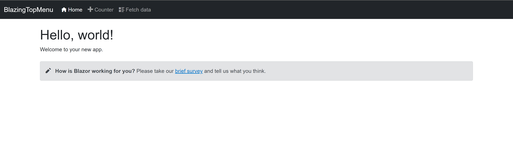
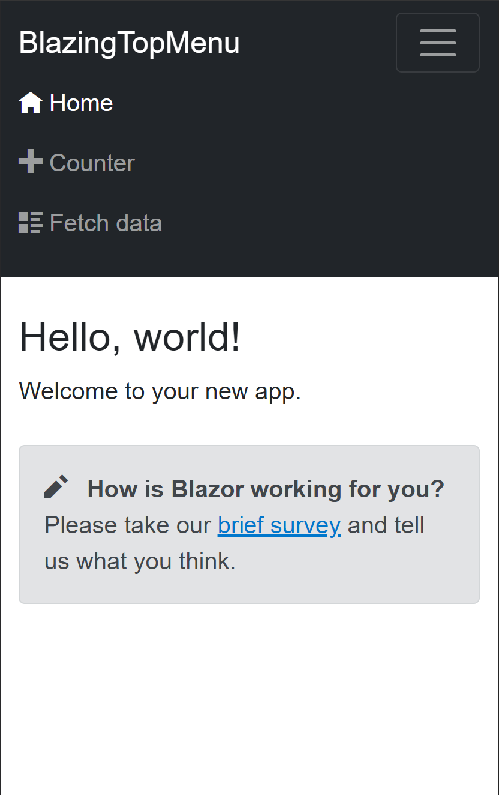

[](https://dev.azure.com/ningranm0982/5a1c7c22-d0a6-4f46-9c9e-a15e1d65b58d/_boards/board/t/3b8fc8a0-95f0-43f4-96cb-0b41efd52473/Microsoft.RequirementCategory)
# Blazor Top NavBar Menu Example

This is an example of a bootstrap top navigation bar menu created for blazor. The default blazor template comes with a sidebar, and there's no default implementation of a top navbar. This example is built on bootstrap 5, which already comes with blazor

This is the final result:

Desktop view:



Mobile view:



# Steps

First create a new blazor project

```
dotnet new blazorwasm -o BlazingTopMenu
```

Then open the project with Visual Studio or VS Code

```
cd BlazingTopMenu
code .
```

Make the following four changes:

1. Replace the contents of `Shared/MainLayout.razor` with this:

```
@inherits LayoutComponentBase

<NavMenu />

<main class="container">
    @Body
</main>

```

2. Replace the contents of Shared/NavMenu.razor with this:

```
<nav class="navbar navbar-expand-md navbar-dark bg-dark mb-4">
    <div class="container-fluid">
        <a class="navbar-brand" href="">BlazingTopMenu</a>
        <button class="navbar-toggler @NavButtonCssClass" type="button" data-bs-toggle="collapse" data-bs-target="#navbarCollapse"
                aria-controls="navbarCollapse" aria-label="Toggle navigation" @onclick="ToggleNavMenu">
            <span class="navbar-toggler-icon"></span>
        </button>
        <div class="collapse navbar-collapse @NavBarCssClass" id="navbarCollapse" @onclick="ToggleNavMenu">
            <ul class="navbar-nav me-auto mb-2 mb-md-0">
                <li class="nav-item">
                    <NavLink class="nav-link" href="" Match="NavLinkMatch.All">
                        <span class="oi oi-home" aria-hidden="true"></span> Home
                    </NavLink>
                </li>
                <li class="nav-item">
                    <NavLink class="nav-link" href="counter">
                        <span class="oi oi-plus" aria-hidden="true"></span> Counter
                    </NavLink>
                </li>
                <li class="nav-item">
                    <NavLink class="nav-link" href="fetchdata">
                        <span class="oi oi-list-rich" aria-hidden="true"></span> Fetch data
                    </NavLink>
                </li>
            </ul>
        </div>
    </div>
</nav>

@code {
    private bool collapseNavMenu = true;
    private string? NavBarCssClass => collapseNavMenu ? null : "show";
    private string? NavButtonCssClass => collapseNavMenu ? "collapsed" : null;

    private void ToggleNavMenu()
    {
        collapseNavMenu = !collapseNavMenu;
    }
}

```

3. Delete `Shared/MainLayout.razor.css`

4. Delete `Shared/NavMenu.razor.css`


And you're good to go!!! Run your code to view the changes.

```
dotnet watch run
```
